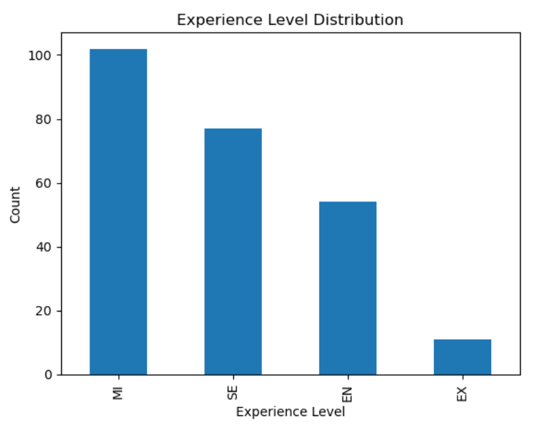
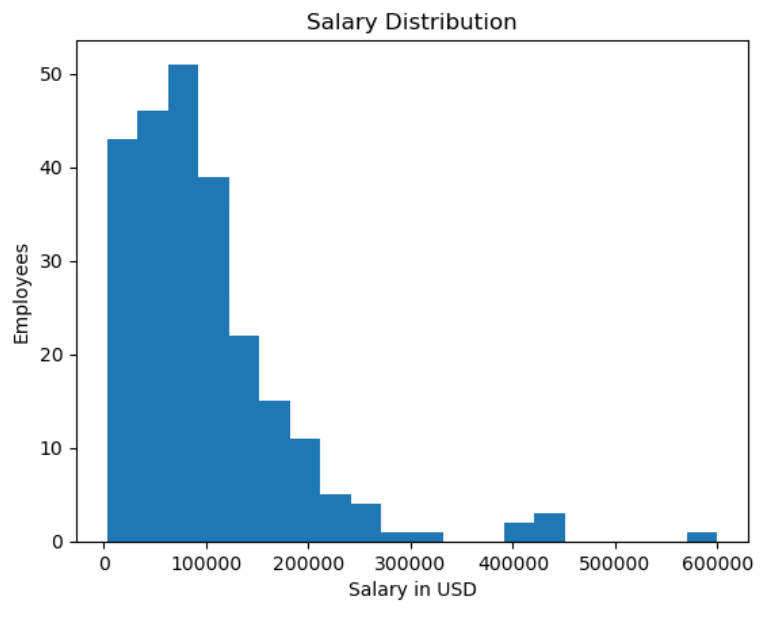
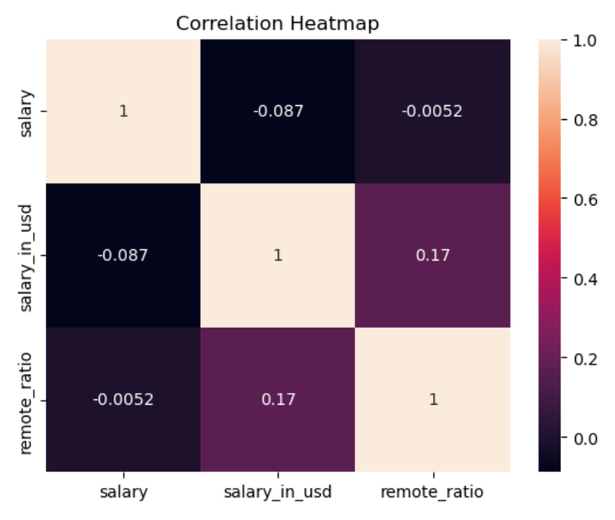

# Salary EDA Project

## 📌 Project Objective
This project performs Exploratory Data Analysis (EDA) on a Data Science Jobs Salaries dataset to understand salary trends, job roles, company size, remote work, and employment types.

## 🛠️ Tools Used
- Python
- Pandas
- NumPy
- Matplotlib
- Seaborn
- Jupyter Notebook

## 📂 Dataset
Data Science Jobs Salaries.csv

## 📷 Experience Level Distribution\

## 📊 Salary Distribution

## 🔥 Correlation Heatmap

## 📊 Analysis Performed
- Data Loading
- Data Exploration
- Missing Value Analysis
- Duplicate Value Analysis
- Statistical Summary
- Data Visualization
- Correlation Analysis

## 📈 Visualizations
- Experience Level Distribution
- Employment Type Distribution
- Salary Distribution
- Company Size Analysis
- Remote Work Analysis
- Work Year Analysis
- Top Job Titles
- Correlation Heatmap

## 🔍 Key Insights
- Most employees are Full-Time.
- Salaries vary significantly across different job roles.
- Medium-sized companies employ many professionals.
- Remote work is common in data science jobs.
- Data Scientist and Data Engineer are among the most common job titles.

## ✅ Conclusion
This project demonstrates how Exploratory Data Analysis (EDA) can be used to understand trends, clean data, visualize patterns, and generate business insights using Python.
